# | oss 기말 프로젝트

 저장소 : https://github.com/rkdckdfhr/2026oss

| 팀원(역할) | 업무 |
| --- | --- |
| 강창록(팀장 – 202507021) | main 브랜치와 README.md 수정 |
| 정진관(팀원 – 202507020) | dev/a 브랜치 수정 |
| 박성현(팀원 – 202507006) | dev/b 브랜치 수정 |
| 장주혁(팀원 – 202507019) | dev/c 브랜치 수정 |

---
### 문제해결 방법과 순서
---
1. main 브렌치와 dev/a 브렌치 병합 중 충돌 발생
2. 충돌 발생한 dev/a의 내용을 수정 후 병합 완료
3. main 브렌치와 dev/b 브렌치 병합 중 충돌 발생
4. 충돌 발생한 dev/b의 내용을 수정 후 병합 완료
5. main 브렌치와 dev/c 브렌치 병합 중 충돌 발생
6. 충돌 발생한 dev/c의 내용을 수정 후 병합 완료
7. main 브렌치에서 최종 코드 확인 후 수정
8. 최종 결과 화면 캡쳐와 실행 화면 캡쳐
9. README.md 수정

## 중간과정 스크린샷

1. main 브렌치에서 calc.cpp 코드 수정
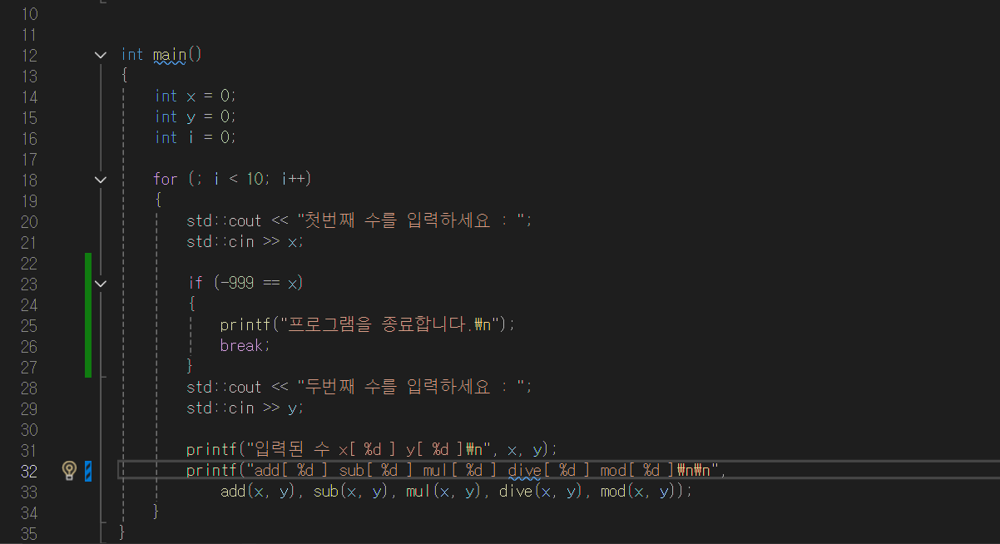

2. dev/a add.cpp, sub.cpp 코드 수정
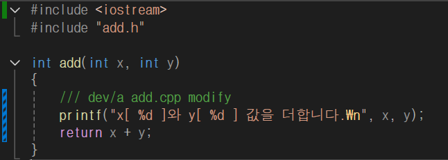
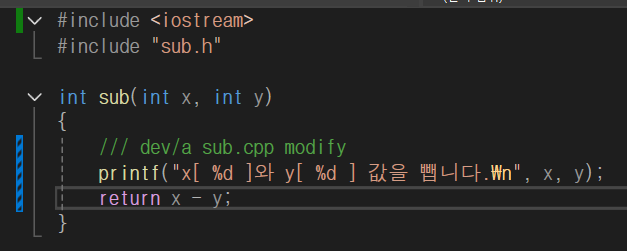

3. main 브렌치와 dev/a 병합 중 충돌 발생 내용
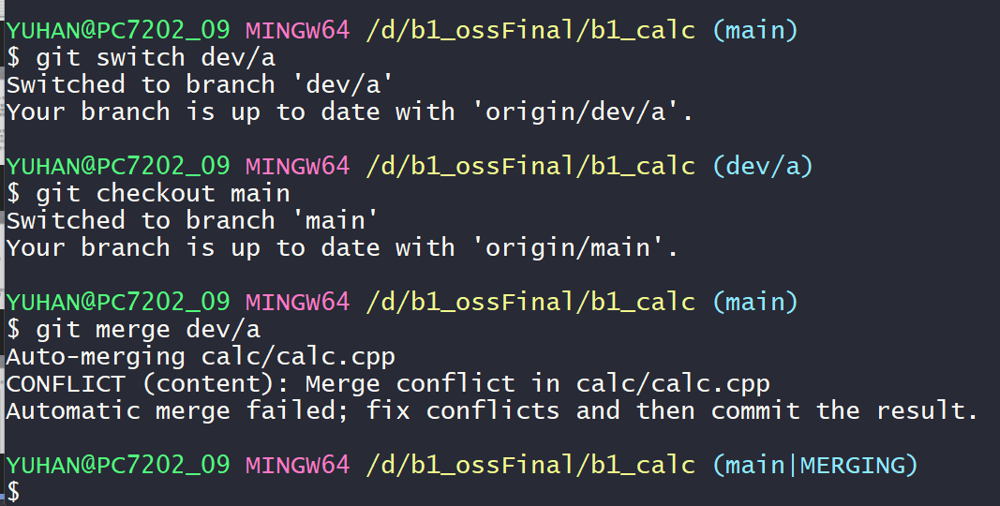
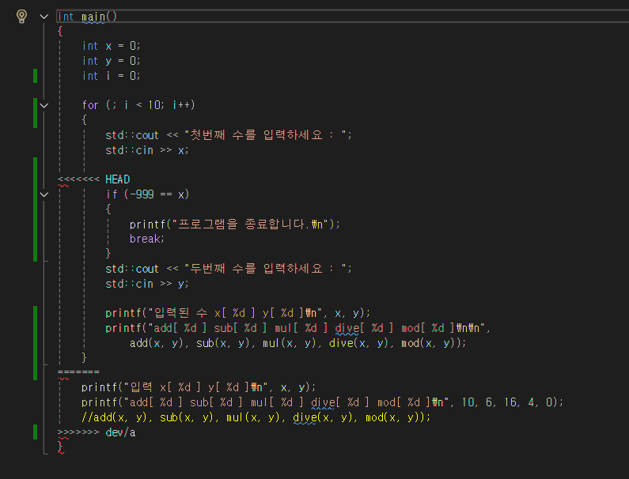

4. dev/a 병합 완료
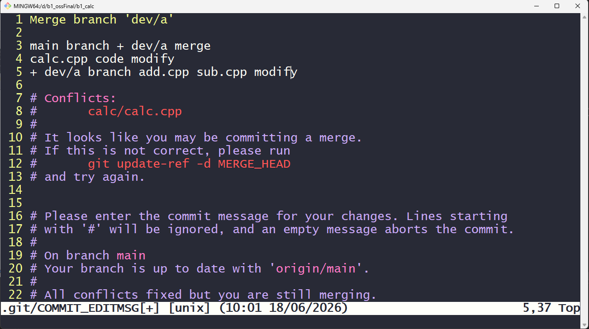

5. dev/b mul.cpp mod.cpp 코드 수정 
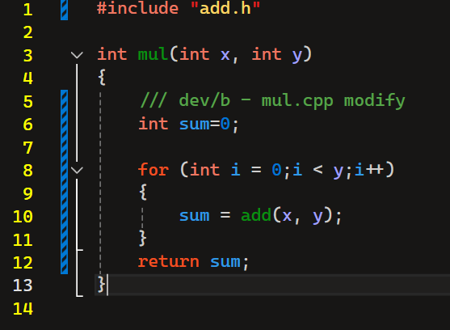
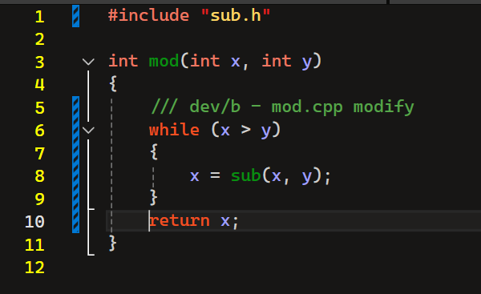

6. main 브렌치와 dev/b 병합 중 충돌 발생 내용
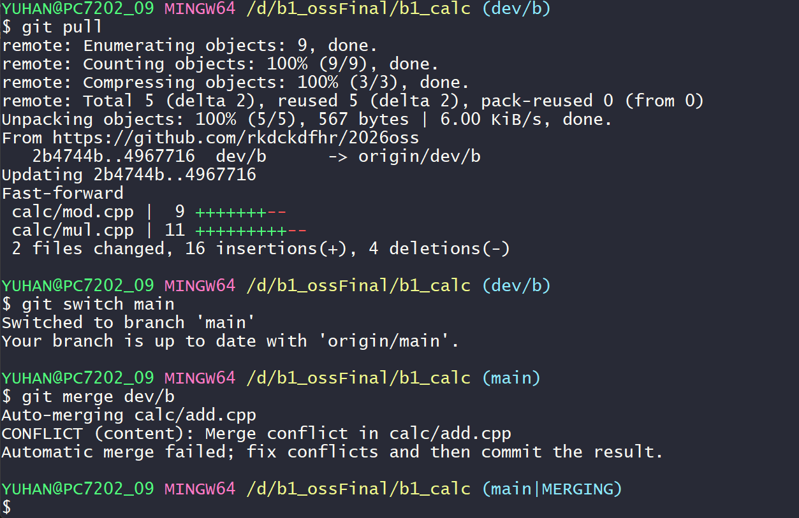
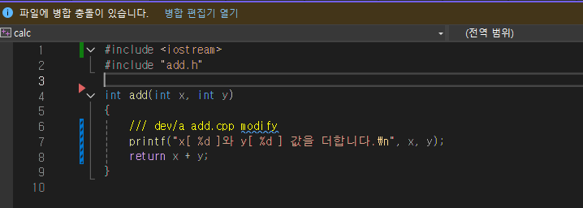

7. dev/b 병합 완료
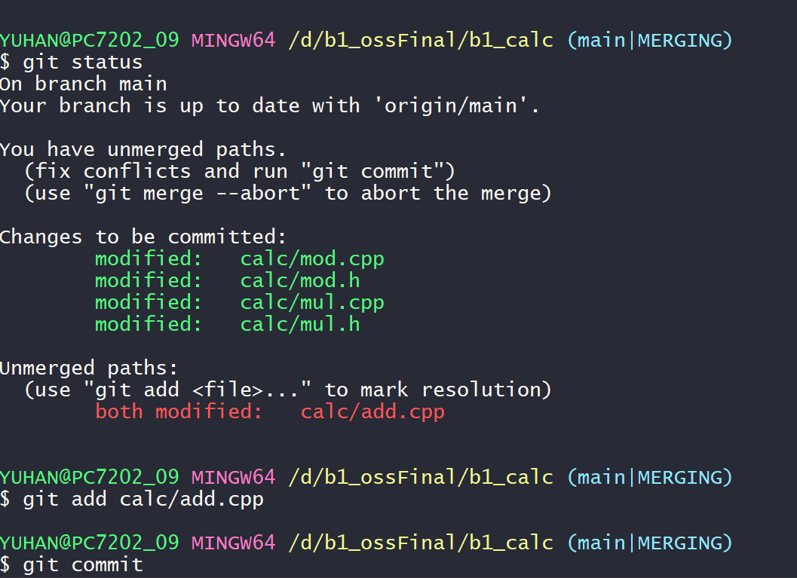

8. dev/c dive.cpp 코드 수정
.png)

9. main 브렌치와 dev/c 병합 중 충돌 발생 내용
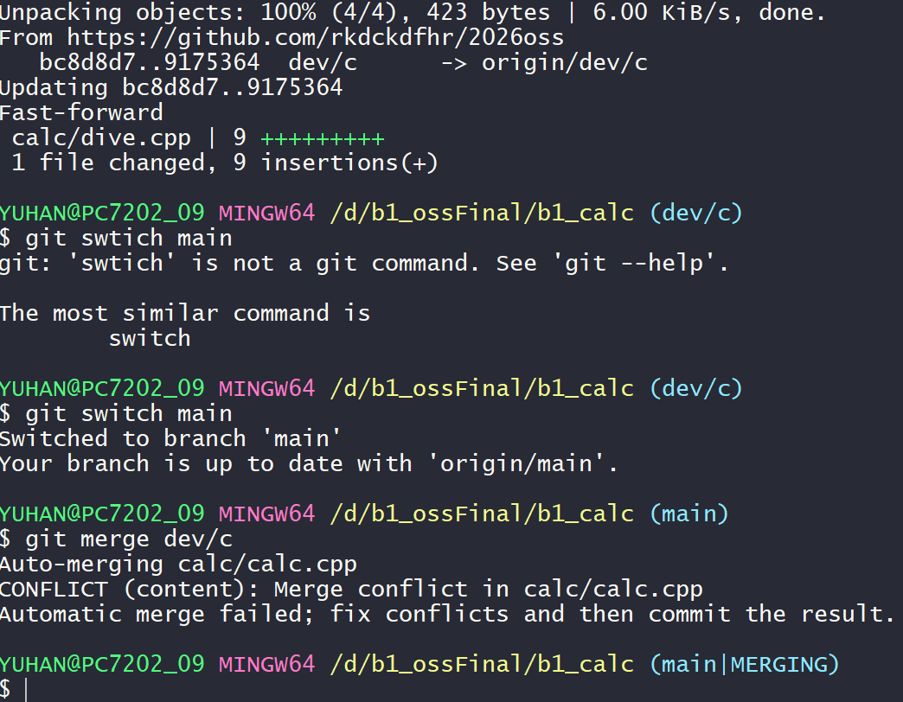
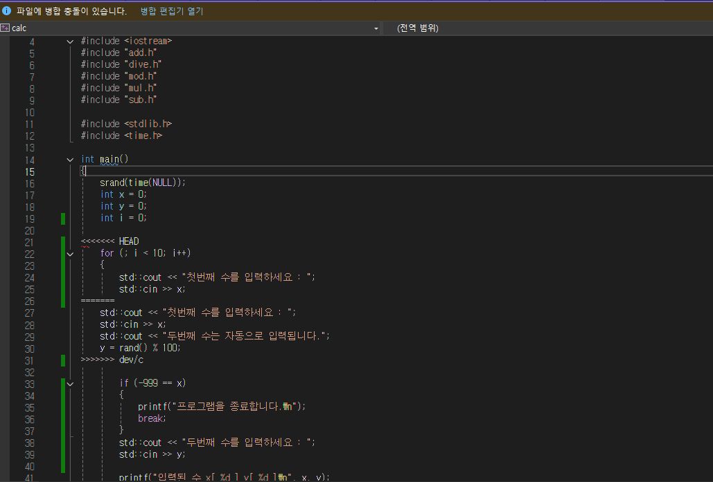

10. dev/c 병합 완료
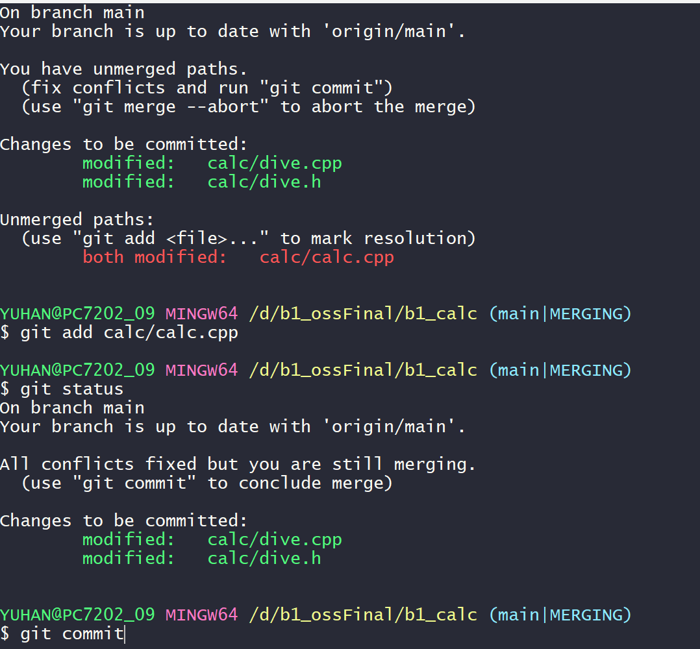

11. main 브렌치에서 최종 코드 수정
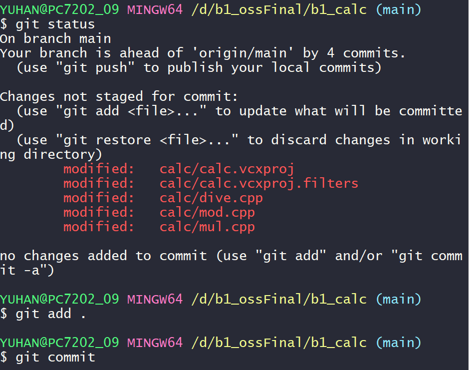

## git flow : 결과 화면
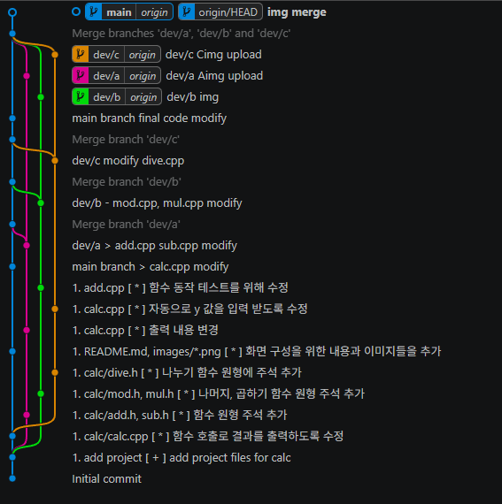

## 프로그램 실행 결과 화면
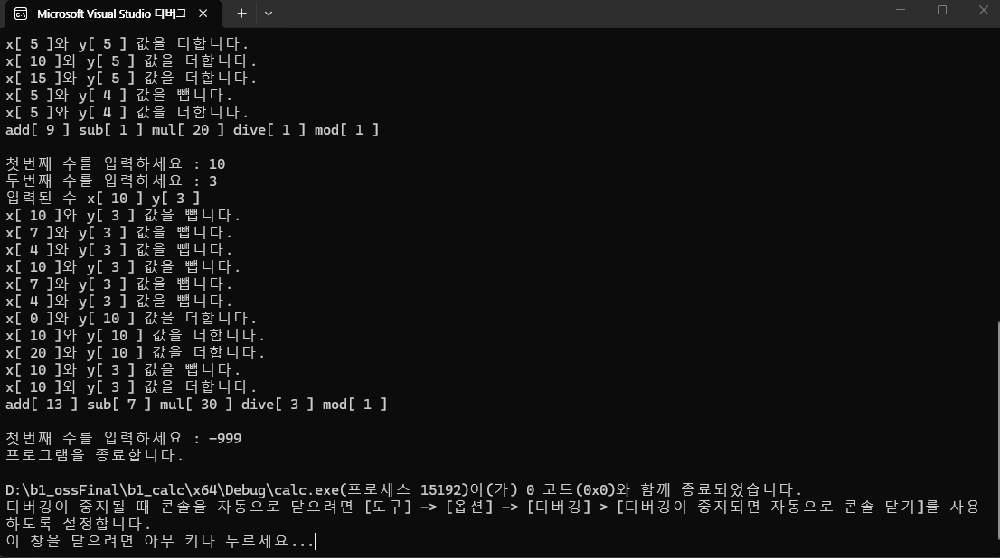